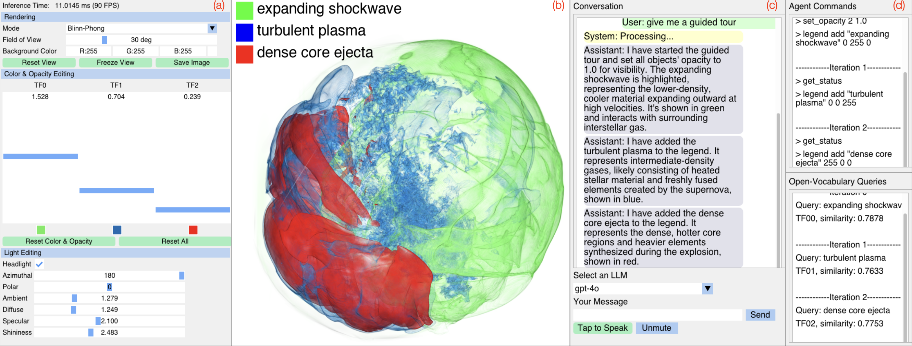
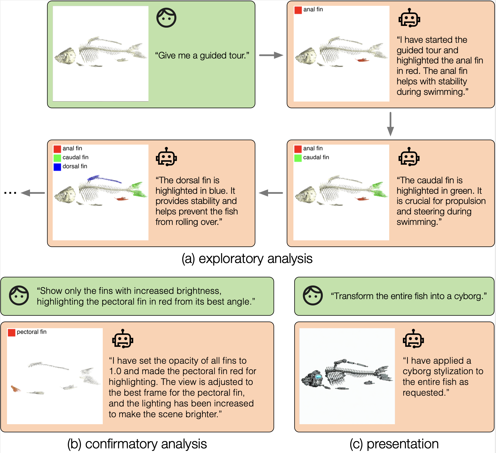
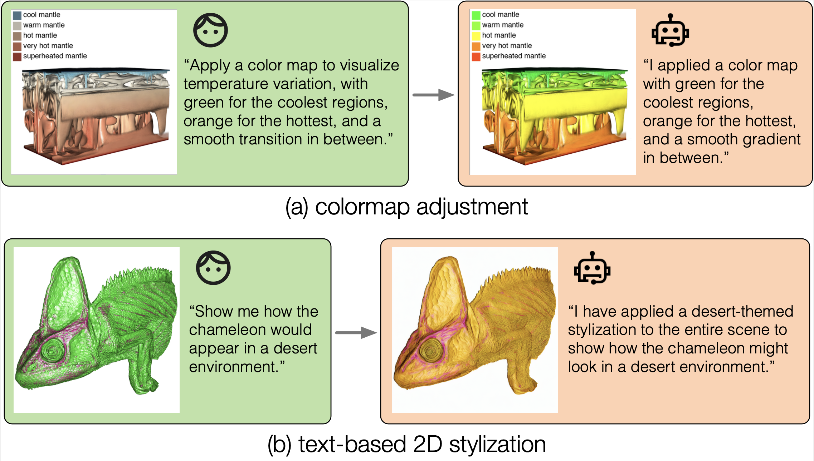
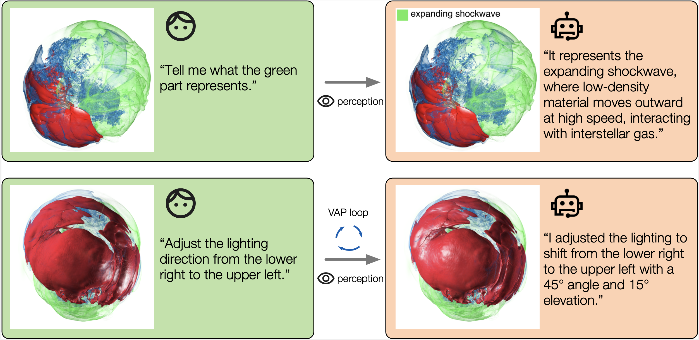

# NLI4VolVis: Natural Language Interaction for Volume Visualization via LLM Multi-Agents and Editable 3D Gaussian Splatting

🌐 **[Project Page](https://nli4volvis.github.io/)** | 🎥 **[Demo Video](https://youtu.be/40vC-qHO5nY)**


The NLI4VolVis interface consists of four key components: (a) control panel, (b) rendering window, (c) chat widget, and (d) action log.
## Description
This is the official implementation of the paper "NLI4VolVis: Natural Language Interaction for Volume Visualization
via LLM Multi-Agents and Editable 3D Gaussian Splatting".

## Setup

```bash
conda env create --file environment.yml
conda activate nli4volvis
```
We recommend users compile these extensions with CUDA 11.8 and torch>=2.1.2.
```bash
# install pytorch based on your CUDA version first
pip install torch==2.1.2 torchvision==0.16.2 torchaudio==2.1.2 --index-url https://download.pytorch.org/whl/cu118
pip install -e ./submodules/diff-gaussian-rasterization --use-pep517
pip install -e ./submodules/simple-knn  
```

## Overview
This codebase includes the NLI and the training of basic 3DGS models.

- We provide 4 processed datasets to explore with: carp, supernova, chameleon and mantle. 

- If you want to use you own data, we also provide jupyter notebooks supporting 3 multi-view semantic segmentation methods: [LangSplat](https://github.com/VIS2025-1444/NLI4VolVis-LangSplat), [SAGD](https://github.com/VIS2025-1444/NLI4VolVis-SAGD) and [SAM 2](https://github.com/VIS2025-1444/NLI4VolVis-SAM2).

- If you already have segmented multi-view image datasets, refer to ``./postprocess`` for examples about NLI4VolVis post processing (including best-view selection and 3D open-vocabulary scene understanding).

The codebase has been tested on Ubuntu Linux 22.04. Instructions for preparing the data and training basic 3DGS scenes can be found in the following sections.

## Dataset structure
We organize the datasets like this:

```
./ImgData
└── <dataset_name>
    ├── dataset_info.txt
    ├── initial_view.txt
    ├── TF01
    │   ├── test
    │   ├── train
    │   ├── transforms_test.json
    │   ├── transforms_train.json
    │   ├── best_frame.txt
    │   └── CLIP_embedding.npy
    ├── TF02
    ├── TF03
    ...
```
where ``TF01`` is the first sampled transfer function (TF) or the first semantic component, ``test`` and ``train`` are two dictionary that contatining the testing and training images, ``.json`` files stores the camera poses.

We release 4 processed datasets: carp, supernova, chameleon and mantle and the editable 3DGS model ckpts [here](https://drive.google.com/drive/folders/1Kmci_-1dxO9LAJ22WikbgroBwNKEgFSV?usp=sharing). You can download these datasets and ckpts, and put them into folders ``./ImgData`` and ``./output`` respectively.

## Train basic editable 3DGS scenes
(You can skip this part if you have downloaded the model ckpts and put them into ``./output``)
The following code will train the basic editable 3DGS scenes on the carp dataset with 7 semantic components:
```bash
cd scripts
bash run_carp.sh
```
After training, all basic models will be stored in ``./output/carp_boneRGBa_sags_class7``.

## Run natural language interface
```bash
bash NLI.sh
```
Feel free to explore NLI4VolVis now! Here we provide several example cases:
<p align="center">
  
  <p align="center">
  <em>Figure 1: Carp dataset.</em>
  </p>
</p>

<p align="center">
  
  <p align="center">
  <em>Figure 2: Mantle and Chameleon datasets.</em>
  </p>
</p>

<p align="center">
  
  <p align="center">
  <em>Figure 3: Supernova dataset.</em>
  </p>
</p>

## Use your own datasets
If you'd like to use your own data, we provide Jupyter notebooks supporting three multi-view semantic segmentation methods to help you prepare your dataset:
- [LangSplat](https://github.com/VIS2025-1444/NLI4VolVis-LangSplat)
- [SAGD](https://github.com/VIS2025-1444/NLI4VolVis-SAGD)
- [SAM 2](https://github.com/VIS2025-1444/NLI4VolVis-SAM2)

## Acknowledgement
We sincerely thank the open-source community for their invaluable contributions. This project is made possible thanks to the following outstanding projects:
- [iVR-GS](https://github.com/TouKaienn/iVR-GS)
- [reduced-3dgs](https://github.com/graphdeco-inria/reduced-3dgs)
- [Relightable3DGaussian](https://github.com/NJU-3DV/Relightable3DGaussian)
- [DearPyGui](https://github.com/NJU-3DV/Relightable3DGaussian)

## Citation
If you find this work useful, please consider citing our paper:
```bibtex
@inproceedings{ai2025nli4volvis,
  title={NLI4VolVis: Natural Language Interaction for Volume Visualization via LLM Multi-Agents and Editable 3D Gaussian Splatting},
  author={Ai, Kuangshi and Tang, Kaiyuan and Wang, Chaoli},
  booktitle={Proceedings of IEEE Visualization Conference},
  year={2025},
  organization={IEEE}
}
```